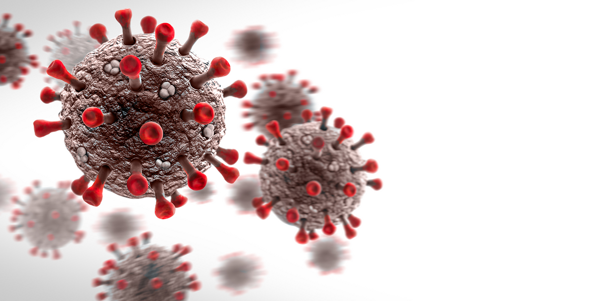

# Covid-19-Project

Watch the steps of complete the project from link https://www.youtube.com/watch?v=fx2N7XmCRZ4

# Coronavirus disease (COVID-19)

Coronavirus disease (COVID-19) is an infectious disease caused by the SARS-CoV-2 virus.

Most people infected with the virus will experience mild to moderate respiratory illness and recover without requiring special treatment. However, some will become seriously ill and require medical attention. Older people and those with underlying medical conditions like cardiovascular disease, diabetes, chronic respiratory disease, or cancer are more likely to develop serious illness. Anyone can get sick with COVID-19 and become seriously ill or die at any age. 
The virus can spread from an infected person’s mouth or nose in small liquid particles when they cough, sneeze, speak, sing or breathe. These particles range from larger respiratory droplets to smaller aerosols. It is important to practice respiratory etiquette, for example by coughing into a flexed elbow, and to stay home and self-isolate until you recover if you feel unwell.

    

# Context

*   A new coronavirus designated 2019-nCoV was first identified in Wuhan, the capital of China's Hubei province
*   People developed pneumonia without a clear cause and for which existing vaccines or treatments were not effective.
*   The virus has shown evidence of human-to-human transmission
*   Transmission rate (rate of infection) appeared to escalate in mid-January 2020
*   As of 30 January 2020, approximately 8,243 cases have been confirmed

# Acknowledgements

Thanks to Indian Ministry of Health & Family Welfare for making the data available to general public.

Thanks to covid19india.org for making the individual level details, testing details, vaccination details available to general public.

Thanks to Wikipedia for population information.

Thanks to the Team at ISIBang

Photo Courtesy - https://hgis.uw.edu/virus/
